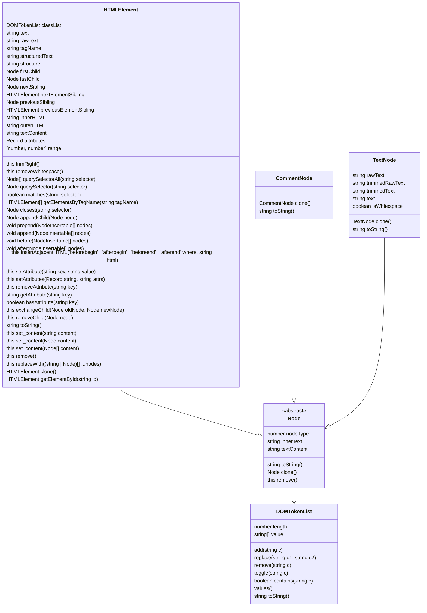

# Node HTML Parser [](http://badge.fury.io/js/node-html-parser) [](https://actions-badge.atrox.dev/taoqf%2Fnode-html-parser/goto?ref=main)

> A very fast HTML parser that builds a simplified DOM tree with CSS selector support.

Fast HTML Parser is a _very fast_ HTML parser. It generates a simplified DOM
tree, with element query support.

Per the design, it intends to parse massive HTML files at the lowest cost, thus
performance is the top priority. For this reason, some malformatted HTML may not
be able to parse correctly, but most usual errors are covered (eg. HTML4 style
no closing `<td>` etc).

## Table of Contents

- [Features](#features)
- [Installation](#installation)
- [Quick Start](#quick-start)
- [Performance](#performance)
- [Parsing Options](#parsing-options)
- [API Reference](#api-reference)
  - [HTMLElement Properties](#htmlelement-properties)
    - [Identity & structure](#identity--structure)
    - [Text & content](#text--content)
    - [Attributes](#attributes)
    - [Serialization](#serialization)
    - [Traversal](#traversal)
    - [Source & metadata](#source--metadata)
  - [HTMLElement Methods](#htmlelement-methods)
    - [Querying](#querying)
    - [DOM insertion](#dom-insertion)
    - [Attribute methods](#attribute-methods)
    - [classList methods](#classlist-methods)
    - [Tree mutation](#tree-mutation)
    - [Serialization & misc](#serialization--misc)
  - [Node](#node)
  - [TextNode](#textnode)
  - [CommentNode](#commentnode)
  - [DOMTokenList](#domtokenlist)
- [Recipes](#recipes)
- [Types](#types)

## Features

- **Fast** — designed to parse massive HTML files with performance as the top priority. See [Performance](#performance).
- **Simplified DOM tree** with full parent/child/sibling traversal.
- **CSS3 selector queries** via `querySelector`, `querySelectorAll`, `matches`, and `closest`.
- **DOM mutation API** — `append`, `prepend`, `before`, `after`, `setAttribute`, `classList`, `replaceWith`, and more.
- **Tolerant of malformed HTML** — covers most common errors (e.g. HTML4-style unclosed `<td>`).
- **Configurable parsing** — void tags, comment retention, block-text elements, and tag-nesting fixes.
- **TypeScript support** — ships type definitions (minimum TypeScript `^4.1.2`).

## Installation

```shell
npm install --save node-html-parser
```

> Note: when using Node HTML Parser in a Typescript project the minimum Typescript version supported is `^4.1.2`.

## Quick Start

```ts
import { parse } from 'node-html-parser';

const root = parse('<ul id="list"><li>Hello World</li></ul>');

// parse() adds a wrapper node, so the input data's first node is the root's first child node
console.log(root.firstChild.structure);
// ul#list
//   li
//     #text

console.log(root.querySelector('#list'));
// { tagName: 'UL',
//   rawAttrs: 'id="list"',
//   childNodes:
//    [ { tagName: 'LI',
//        rawAttrs: '',
//        childNodes: [Object],
//        classNames: [] } ],
//   id: 'list',
//   classNames: [] }
console.log(root.toString());
// <ul id="list"><li>Hello World</li></ul>
root.set_content('<li>Hello World</li>');
root.toString(); // <li>Hello World</li>
```

CommonJS:

```js
var HTMLParser = require('node-html-parser');

var root = HTMLParser.parse('<ul id="list"><li>Hello World</li></ul>');
```

## Performance

-- 2026-06-20

```shell
html-parser     :12.5662 ms/file ± 10.0834
htmljs-parser   :0.233045 ms/file ± 0.525111
html-dom-parser :1.07375 ms/file ± 0.811077
html5parser     :0.824501 ms/file ± 0.540651
cheerio         :3.27444 ms/file ± 2.06027
parse5          :2.43857 ms/file ± 1.56153
htmlparser2     :0.712490 ms/file ± 0.364630
htmlparser      :10.5275 ms/file ± 82.6013
high5           :1.64003 ms/file ± 0.993116
node-html-parser:0.972389 ms/file ± 0.570578
node-html-parser (last release):0.961381 ms/file ± 0.553054
```

Tested with [htmlparser-benchmark](https://github.com/AndreasMadsen/htmlparser-benchmark).

## Parsing Options

### parse(data[, options])

Parse the data provided, wrap the result in a new node, and return the root of the generated DOM.

- **data**, data to parse
- **options**, parse options

| Option | Type | Default | Description |
| --- | --- | --- | --- |
| `lowerCaseTagName` | `boolean` | `false` | Convert tag names to lower case (hurts performance heavily) |
| `comment` | `boolean` | `false` | Retrieve comment nodes (hurts performance slightly) |
| `fixNestedATags` | `boolean` | `false` | Fix invalid nested `<a>` HTML tags |
| `parseNoneClosedTags` | `boolean` | `false` | Close non-closed HTML tags instead of removing them |
| `preserveTagNesting` | `boolean` | `false` | Preserve invalid HTML nesting instead of auto-closing tags (e.g. `<p><p>bar</p></p>`) |
| `blockTextElements` | `{ [tag: string]: boolean }` | `{ script: true, noscript: true, style: true, pre: true }` | Tags whose text content is kept as raw text when parsing |
| `voidTag.tags` | `string[]` | `['area', 'base', 'br', 'col', 'embed', 'hr', 'img', 'input', 'link', 'meta', 'param', 'source', 'track', 'wbr']` | Void (self-closing) element tags. Optional and case insensitive |
| `voidTag.closingSlash` | `boolean` | `false` | Void tag serialisation: add a final slash, e.g. `<br/>` |
| `closeAllByClosing` | `boolean` | `false` | Close all non-closed tags when the containing element closes |

### valid(data[, options])

Parse the data provided and return `true` if it is well-formed (all tags properly closed/matched), `false` otherwise.

## API Reference

The parser produces a tree of nodes. `HTMLElement` is the primary node type; `TextNode` and `CommentNode` extend the abstract [`Node`](#node) base class. The class diagram below shows how they relate.



Class reference:

- [`HTMLElement`](#htmlelement-properties) — the main element node ([properties](#htmlelement-properties) · [methods](#htmlelement-methods)).
- [`Node`](#node) — abstract base class.
- [`TextNode`](#textnode) — a run of text.
- [`CommentNode`](#commentnode) — an HTML comment.
- [`DOMTokenList`](#domtokenlist) — the `classList` property's type.

## HTMLElement Properties

### Identity & structure

| Property | Type | Summary |
| --- | --- | --- |
| `tagName` | `string` | Tag name (uppercase). Get or set. |
| `localName` | `string` | Lowercase tag name (mirrors the DOM `Element.localName`). |
| `id` | `string` | The `id` attribute. Get or set (setter → `setAttribute`). |
| `classNames` | `string` | Space-joined class string, e.g. `'foo bar'` (string form of `classList`). |
| `classList` | `DOMTokenList` | Token list for the `class` attribute. See [classList methods](#classlist-methods). |
| `isVoidElement` | `boolean` | `true` if the tag is a configured void element (per `voidTag.tags`). |
| `structure` | `string` | DOM structure overview. |

### Text & content

| Property | Type | Summary |
| --- | --- | --- |
| `text` | `string` | Unescaped text of this node and its descendants (like `innerText`). Slow first time. |
| `rawText` | `string` | Escaped (as-is) text; may contain `&amp;`. Fast. |
| `textContent` | `string` | Get or set text content (more efficient than `set_content`). |
| `innerText` | `string` | Escaped text of this node and its descendants. _(inherited from `Node`)_ |
| `structuredText` | `string` | Block-aware text of this subtree. |

### Attributes

| Property | Type | Summary |
| --- | --- | --- |
| `attributes` | `Record<string, string>` | All attributes (decoded). **Do not mutate the returned value.** |
| `attrs` | `Record<string, string>` | Decoded attributes with lowercased keys. Internal helper — prefer `getAttribute` / `attributes`. |
| `rawAttributes` | `Record<string, string>` | Raw (not decoded) attributes, so `&amp;` stays literal. |

### Serialization

| Property | Type | Summary |
| --- | --- | --- |
| `innerHTML` | `string` | Get or set inner HTML. |
| `outerHTML` | `string` | Serialized outer HTML. |

### Traversal

| Property | Type | Summary |
| --- | --- | --- |
| `childNodes` | `Node[]` | All child nodes (text, comment, element). |
| `children` | `HTMLElement[]` | Child nodes of type `HTMLElement`. |
| `childElementCount` | `number` | Number of element children. |
| `firstChild` | `Node \| undefined` | First child node. `undefined` if none. |
| `lastChild` | `Node \| undefined` | Last child node. `undefined` if none. |
| `firstElementChild` | `HTMLElement \| undefined` | First child element. `undefined` if none. |
| `lastElementChild` | `HTMLElement \| undefined` | Last child element. `undefined` if none. |
| `nextSibling` | `Node \| null` | Next sibling node. |
| `previousSibling` | `Node \| null` | Previous sibling node. |
| `nextElementSibling` | `HTMLElement \| null` | Next sibling element. |
| `previousElementSibling` | `HTMLElement \| null` | Previous sibling element. |
| `parentNode` | `HTMLElement \| null` | Parent element. _(inherited from `Node`)_ |

### Source & metadata

| Property | Type | Summary |
| --- | --- | --- |
| `nodeType` | `NodeType` | Always `NodeType.ELEMENT_NODE` (`1`). _(inherited from `Node`)_ |
| `range` | `[number, number]` | Source `[start, end]` offsets. _(inherited)_ |

## HTMLElement Methods

Where `NodeInsertable = Node | string` and `InsertPosition = 'beforebegin' | 'afterbegin' | 'beforeend' | 'afterend'`.

### Querying

| Method | Returns | Summary |
| --- | --- | --- |
| `querySelectorAll(selector)` | `HTMLElement[]` | All matches for a CSS selector (full CSS3 since v3.0.0). |
| `querySelector(selector)` | `HTMLElement \| null` | First match for a CSS selector. |
| `matches(selector)` | `boolean` | Whether this element matches a selector. |
| `closest(selector)` | `HTMLElement \| null` | Nearest ancestor (incl. self) matching a selector. |
| `getElementsByTagName(tagName)` | `HTMLElement[]` | All descendants with the given tag (`*` = all). |
| `getElementById(id)` | `HTMLElement \| null` | First descendant with the given id. |

### DOM insertion

| Method | Returns | Summary |
| --- | --- | --- |
| `append(...nodes)` | `void` | Append node(s)/text to end of children (variadic; strings → `TextNode`). |
| `prepend(...nodes)` | `void` | Prepend node(s)/text to start of children. |
| `appendChild(node)` | the node | Append a single node to children. |
| `insertAdjacentHTML(where, html)` | `this` | Insert parsed HTML relative to this element. |
| `before(...nodes)` | `void` | Insert node(s)/text before this element (not on root). |
| `after(...nodes)` | `void` | Insert node(s)/text after this element (not on root). |

### Attribute methods

| Method | Returns | Summary |
| --- | --- | --- |
| `setAttribute(key, value)` | `this` | Set an attribute. |
| `setAttributes(attrs)` | `this` | Set multiple attributes. |
| `getAttribute(key)` | `string \| undefined` | Get an attribute. |
| `hasAttribute(key)` | `boolean` | Whether an attribute is set. |
| `removeAttribute(key)` | `this` | Remove an attribute. |

### classList methods

The `classList` property is a [`DOMTokenList`](#domtokenlist) — use `add`, `replace`, `remove`, `toggle`, `contains`, and `value` on it. See [DOMTokenList](#domtokenlist).

### Tree mutation

| Method | Returns | Summary |
| --- | --- | --- |
| `remove()` | `this` | Remove this element from its parent. |
| `replaceWith(...nodes)` | `this` | Replace this element with node(s)/text. |
| `exchangeChild(oldNode, newNode)` | `this` | Swap one child for another. |
| `removeChild(node)` | `this` | Remove a child node. |

### Serialization & misc

| Method | Returns | Summary |
| --- | --- | --- |
| `toString()` | `string` | Same as `outerHTML`. |
| `set_content(content, options?)` | `this` | Replace this element's children. **Not for the root node.** |
| `clone()` | `HTMLElement` | Deep clone of this element. |
| `trimRight(pattern)` | `this` | Trim trailing text matching a pattern. |
| `removeWhitespace()` | `this` | Remove whitespace in this subtree. |

## Node

`Node` is the abstract base class for every node in the tree (`HTMLElement`, `TextNode`, and `CommentNode` all extend it). It is exported but not instantiated directly.

| Member | Signature | Description |
| --- | --- | --- |
| `childNodes` | `Node[]` | Child nodes of this node. |
| `parentNode` | `HTMLElement \| null` | Parent element, or `null` for the root. |
| `range` | `readonly [number, number]` | Source `[start, end]` offsets; `[-1, -1]` if unknown. |
| `nodeType` | `NodeType` | Node type (see [Types](#types)). Abstract — implemented by subclasses. |
| `text` | `string` | Unescaped text. Abstract — implemented by subclasses. |
| `rawText` | `string` | Raw (escaped) text. Abstract — implemented by subclasses. |
| `innerText` | `string` | Returns the raw text. |
| `textContent` | `string` | Get or set the decoded text content. |
| `toString()` | `string` | Serialized representation. Abstract. |
| `clone()` | `Node` | Deep clone of this node. Abstract. |
| `remove()` | `this` | Remove this node from its parent. |

## TextNode

A node representing a run of text inside an element. `nodeType` is `NodeType.TEXT_NODE` (`3`).

| Member | Signature | Description |
| --- | --- | --- |
| `rawText` | `string` | Get or set the raw (escaped) text. Setting it invalidates the trimmed caches. |
| `text` | `string` | Unescaped text value (`decodeHTML(rawText)`). |
| `trimmedRawText` | `string` | Raw text with surrounding whitespace trimmed (preserving a single leading/trailing non-breaking space). |
| `trimmedText` | `string` | Same trim applied to the decoded `text`. |
| `isWhitespace` | `boolean` | `true` if the node contains only whitespace. |
| `nodeType` | `NodeType` | `NodeType.TEXT_NODE` (`3`). |
| `toString()` | `string` | Returns the raw text. |
| `clone()` | `TextNode` | Clone this text node. |

## CommentNode

A node representing an HTML comment. `nodeType` is `NodeType.COMMENT_NODE` (`8`). Its `rawTagName` is `'!--'`, which lets CSS selectors match comments by the `!--` tag name.

| Member | Signature | Description |
| --- | --- | --- |
| `rawText` | `string` | The comment's inner text. |
| `text` | `string` | The comment's inner text (not decoded). |
| `rawTagName` | `string` | `'!--` — used for selector matching. |
| `nodeType` | `NodeType` | `NodeType.COMMENT_NODE` (`8`). |
| `toString()` | `string` | Returns `<!--` + rawText + `-->`. |
| `clone()` | `CommentNode` | Clone this comment node. |

## DOMTokenList

`DOMTokenList` is the type of an [`HTMLElement`](#htmlelement-properties)'s `classList` property. It is **not exported** — access it via `element.classList`. Unlike the DOM spec, `toggle` takes no `force` argument and returns `void`, and `replace` always succeeds.

| Member | Signature | Description |
| --- | --- | --- |
| `add(c)` | `(c: string): void` | Add a token. |
| `replace(c1, c2)` | `(c1: string, c2: string): void` | Replace `c1` with `c2`. |
| `remove(c)` | `(c: string): void` | Remove a token. |
| `toggle(c)` | `(c: string): void` | Add the token if absent, remove it if present. |
| `contains(c)` | `(c: string): boolean` | `true` if the token is present. |
| `length` | `number` | Number of tokens. |
| `value` | `string[]` | The tokens as an array. |
| `values()` | `IterableIterator<string>` | Iterate over the tokens. |
| `toString()` | `string` | Space-joined tokens (e.g. `'foo bar'`). |

## Recipes

### Extract all links

```js
import { parse } from 'node-html-parser';

const root = parse(htmlString);
for (const a of root.querySelectorAll('a')) {
  console.log(a.getAttribute('href'), '→', a.text);
}
```

### Modify attributes, then serialize

```js
const root = parse('<div class="main">yay</div>');
const div = root.querySelector('div.main');
div.set_content('updated content');
div.setAttribute('data-id', '42');
console.log(root.toString());
// <div class="main" data-id="42">updated content</div>
```

### Parse with options

```js
// Keep <pre>/<script>/<style> contents as raw text and retain comments
const root = parse(html, {
  blockTextElements: { script: true, noscript: true, style: true, pre: true },
  comment: true,
});

// Auto-close non-closed tags instead of removing them
parse('<p>a<b>b</p><p>c</p>', { parseNoneClosedTags: true });
```

### Work with classes

```js
const div = parse('<div class="foo bar"></div>').firstChild;
div.classList.value; // ['foo', 'bar']
div.classNames; // 'foo bar'
div.classList.toggle('bar');
div.classNames; // 'foo'
div.classList.contains('foo'); // true
```

### Block-aware text extraction

```js
parse('<span>o<p>a</p><p>b</p>c</span>').structuredText; // 'o\na\nb\nc'
```

## Types

The package exports `parse` (default and named), `valid`, `HTMLElement`, `Node`, `TextNode`, `CommentNode`, `NodeType`, and the `Options` type. `DOMTokenList` is not exported — access it via an element's `classList` property.

| Type | Description |
| --- | --- |
| [`Options`](#parsing-options) | Parse options accepted by `parse()` and `valid()`. See [Parsing Options](#parsing-options). |
| `NodeType` | Enum mirroring the DOM `Node.nodeType` values: `ELEMENT_NODE = 1`, `TEXT_NODE = 3`, `COMMENT_NODE = 8`. |
| `InsertPosition` | `'beforebegin' \| 'afterbegin' \| 'beforeend' \| 'afterend'` — used by `insertAdjacentHTML`. |
| `NodeInsertable` | `Node \| string` — accepted by `append`, `prepend`, `before`, `after`. |

## Contributors

Thanks to everyone who has contributed to `node-html-parser`.

<a href="https://github.com/taoqf/node-html-parser/graphs/contributors">
  
</a>

Contributions are welcome — see [open issues](https://github.com/taoqf/node-html-parser/issues) and [pull requests](https://github.com/taoqf/node-html-parser/pulls).
